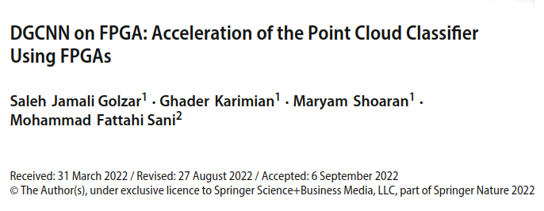

# DeepPoint-V2 Project
This repository contains the second version of the code base for Xilinx SDAccel FPGA implementation of [Dynamic Graph CNN](https://github.com/WangYueFt/dgcnn).
The host program in this repository implements the out-of-order kernel queue. The version with in-order queue is available [here](https://github.com/salehjg/DGCNN-on-FPGA).

# Quick Refs
**Basics:**
- [Building The Project](docs/compile.md)
- [Sample Data and Datasets](docs/datasets.md)
- [Analyzing Profiled Runs](docs/analyze.md)
- [Deploying on AWS-F1](docs/aws.md)
- [Results](docs/results.md)

**Misc:**
- [Debugging The Project](docs/debug.md)
- [DDR Bank Assignment](docs/banks.md)
- [Tips & Tricks!](docs/tips.md)


# Build System
As easy as it is to use SDx GUI, it is recommended to use provided cmake scripts to run synthesis and build the binaries for both the selected FPGA platform and the host.

# Dependencies
This project relies on these software/libraries(These should be installed on the OS):
```
Xilinx SDAccel 2019.1(Tested), 2018.3 2018.2 2017.4(Not Tested)
Xilinx XRT
python3(Symlinked as `python3`)
CMake3 (>3.10, Do **not** use the default CMake package available on AWS-F1)
Bash (>4.0, Dash and others are not tested)
devtoolset-7 (>7.0, For C++14 support)
```
* Make sure that the latest Vivado patches are applied, such as `AR73068`.

# Configuration
To make it easier to explore the design space and try different configurations, all of the parameters that affect the output performance of the task kernels are gathered in a separate submodule repository at directory `config`.
Also please note that various Vivado directives for different steps are used to facilitate design implementation (opt, place, and route).

## Platforms
Refer to the table below.

Name | Supported Platform | Implementation | Datasets
---  | ---                | --- | ---
CModel1 | Cpu, Xil         | CImplementationCpu, CImplementationXil | ShapeNet, ModelNet


## Tests
There are two types of tests for the project, `KernelTests` and `OclTests`. 

### Kernel Tests
`KernelTests` are located at `test/kerneltests` and mainly aim for testing the HLS code of the kernels.
To run the kernel tests, run:
```
make test
```

### Ocl Tests
These tests use Google Test Framework to test the correctness of the kernel outputs in HW-EMU and HW modes along with testing all the OpenCL related infrastructure of the DeepPointFPGA.
The main executable of `OclTests` is located at `test/ocltests/`. To execute the OclTests run this at the build directory:
```
sh LaunchOclTests.sh
``` 

# Project Structure
## Classes
* Tensors
    - CTensor\<T\> : CTensorBase
    - CTensorXil\<T\> : CTensorBase
* Implementations
    - CPlatformSelection
    - CImplementationCpu : CImplementationBase
    - CImplementationXil : CImplementationBase
* Kernels
    - CKernelWrapperBasicOps       : CKernelWrapper
    - CKernelWrapperConcat         : CKernelWrapper
    - CKernelWrapperConv           : CKernelWrapper
    - CKernelWrapperGather         : CKernelWrapper
    - CKernelWrapperMatmul         : CKernelWrapper
    - CKernelWrapperPadUnpad       : CKernelWrapper
    - CKernelWrapperReduce         : CKernelWrapper
    - CKernelWrapperReluSqrtSquare : CKernelWrapper
    - CKernelWrapperTile           : CKernelWrapper
    - CKernelWrapperTopK           : CKernelWrapper
    - CKernelWrapperTranspose      : CKernelWrapper
* Models
    - CClassifierMultiPlatform
    - CModel1
    
* Misc
    - CWeightLoader
    - CProfiler
    - CXilInfo
    - CStringFormatter


 
## Branches
This repository contains multiple branches as described below:

Branch | AXI Width | DType | Tool | Notes
---  |  --- |  --- |  --- |  ---
master | 512-bits | float32 | SDx2019.1 | -

# Citation
Please use the following BibTeX entry:
```
@article{jamali2022dgcnn,
  title={DGCNN on FPGA: Acceleration of the Point Cloud Classifier Using FPGAs},
  author={Jamali Golzar, Saleh and Karimian, Ghader and Shoaran, Maryam and Fattahi Sani, Mohammad},
  journal={Circuits, Systems, and Signal Processing},
  pages={1--32},
  year={2022},
  publisher={Springer}
}
```

# References
These repositories are used in this project:

| Repo | Description | License |
|-|-|-|
| [dgcnn](https://github.com/WangYueFt/dgcnn) | ([Paper(ACM)](https://dl.acm.org/doi/10.1145/3326362), [Paper(Arxiv)](https://arxiv.org/abs/1801.07829)) Dynamic Graph CNN for Point Clouds (Tensorflow) | N/S |
| [DeepPointV1-GPGPU](https://gitlab.com/salehjg/DeepPoint-V1-GPGPU) | Our CUDA/OCL Version of DGCNN | N/S |
| [DeepPointV1-FPGA](https://gitlab.com/salehjg/DeepPoint-V1-FPGA) | Our FPGA Version of DGCNN | N/S |
| [hlslib](https://github.com/definelicht/hlslib) | ([Paper](https://arxiv.org/abs/1910.04436)) CMake/HLS Libraries for Intel and Xilinx | BSD 3-Clause |
| [gemm_hls](https://github.com/spcl/gemm_hls) | ([Paper(ACM)](https://dl.acm.org/doi/abs/10.1145/3373087.3375296), [Paper(Arxiv)](https://arxiv.org/abs/1912.06526)) Scalable matrix matrix multiplication on FPGA | BSD 3-Clause |
| [pp4fpgas](https://github.com/KastnerRG/pp4fpgas) | ([Book(Arxiv)](https://arxiv.org/abs/1805.03648)) Parallel Programming for FPGAs | N/S |
| [cnpy](https://github.com/rogersce/cnpy) | C++ Library for working with `*.npy` files | MIT |
| [PointNet](https://github.com/charlesq34/pointnet) | ([Paper](https://arxiv.org/abs/1612.00593)) PointNet 1 | MIT |
| [PointNet++](https://github.com/charlesq34/pointnet2) | ([Paper](https://arxiv.org/abs/1706.02413)) PointNet 2 | MIT |
| [argparse](https://github.com/jamolnng/argparse) | C++ Library for handling arguments | Apache-2.0-with-LLVM-Exception or GPL-3.0 |
| [spdlog](https://github.com/gabime/spdlog) | C++ Library for fast logging | MIT |
| [rapidjson](https://github.com/Tencent/rapidjson) | A fast JSON parser/generator for C++ with both SAX/DOM style API | MIT |
| [hls_tutorial_examples](https://github.com/spcl/hls_tutorial_examples) | ([Paper](https://arxiv.org/abs/1805.08288)) HLS examples and tutorials (Workshop) | BSD 3-Clause |
| [SimplePasteBin](https://github.com/salehjg/SimplePasteBin) | Python Library for working with PasteBin.com | GPL-3.0 |
| [googletest](https://github.com/google/googletest) | GoogleTest - Google Testing and Mocking Framework | BSD 3-Clause |
